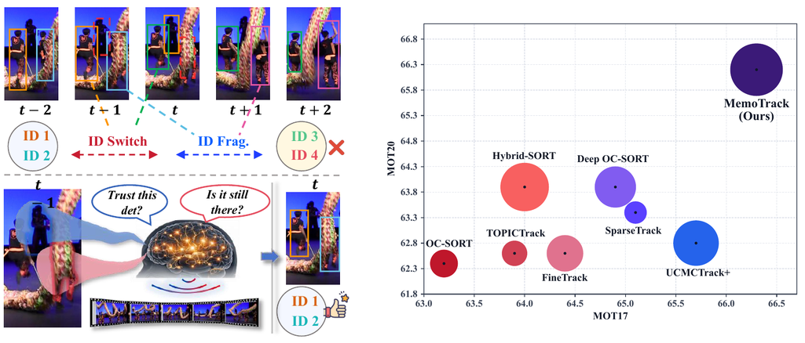
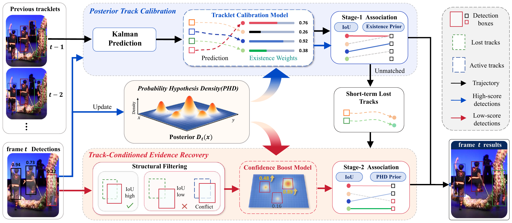

# MemoTrack

<div align="center">

<h2>MemoTrack: Online Multi-Object Tracking by Existence Query</h2>


[](LICENSE)


</div>

<p align="center">
MemoTrack injects queryable PHD posterior evidence into online tracking-by-detection for robust association under occlusion.
</p>

<p align="center">
  
</p>
<p align="center">
  
</p>

## Abstract

Online MOT has long been constrained by a persistent tension: a tracker must
preserve stable primary associations while recovering genuine targets that
momentarily vanish under occlusion or detector degradation. Existing methods
refine association with richer motion and appearance cues, but current-frame
detector scores alone cannot reveal whether a location is still supported by
long-term existence evidence. To address this gap, we propose MemoTrack, a
lightweight PHD existence evidence framework for online MOT. Rather than using a
random finite set filter as a full state estimator or tracker, MemoTrack recasts
the PHD posterior intensity as a queryable cross-frame existence field and
injects it into a standard tracking-by-detection pipeline. Specifically,
Posterior Track Calibration (PTC) queries posterior support at predicted track
locations to calibrate track reliability during high-score association, while
Track-Conditioned Evidence Recovery (TCER) queries posterior evidence at
low-score detections and combines it with track explainability and local
structural constraints to enable controlled recovery. This design preserves the
simplicity of online tracking while providing a second source of evidence beyond
current-frame detector confidence. Experiments show that MemoTrack achieves near
state-of-the-art results across MOT17, DanceTrack, and SportsMOT, and
state-of-the-art IDF1 and AssA scores on MOT20, demonstrating strong robustness
in crowded and heavily occluded scenes.

## Tracking Performance

Results on public test sets are summarized below. `SportsMOT*` follows the
stronger-detector setting used by prior SportsMOT trackers.

| Dataset | HOTA | MOTA | IDF1 | AssA | DetA | AssR | FP | FN | IDs | Frag |
| --- | ---: | ---: | ---: | ---: | ---: | ---: | :---: | :---: | ---: | ---: |
| MOT17 | 66.1 | 80.4 | 81.8 | 67.3 | 65.3 | 72.8 | 23,982 | 85,848 | 1,035 | 1,713 |
| MOT20 | 66.2 | 76.9 | 82.0 | 69.1 | 63.7 | 73.1 | 20,004 | 98,616 | 685 | 860 |
| DanceTrack | 60.2 | 93.2 | 61.1 | 45.0 | 80.6 | 50.2 | 7,874 | 10,520 | 1,378 | 2,066 |
| SportsMOT | 70.9 | 94.6 | 72.0 | 59.3 | 84.8 | 61.5 | 27,690 | 24,471 | 2,974 | 3,633 |
| SportsMOT* | 72.0 | 96.4 | 73.1 | 59.9 | 86.6 | 62.2 | 13,319 | 20,828 | 2,882 | 3,387 |

## Installation

The code was tested on Ubuntu 22.04 with CUDA, PyTorch, YOLOX, FastReID, and
TrackEval.

```bash
git clone https://github.com/wangproc/MemoTrack.git
cd MemoTrack

conda env create -f environment.yml
conda activate boostTrack
```

Install external detector/ReID dependencies if they are not already available in
your environment:

```bash
cd external/YOLOX
pip install -r requirements.txt && python setup.py develop

cd ../deep-person-reid
pip install -r requirements.txt && python setup.py develop

cd ../fast_reid
pip install -r docs/requirements.txt
cd ../..
```

## Data Preparation

Download the datasets and place them under `data/`:

```text
data/
|-- MOT17/
|   |-- train/
|   `-- test/
|-- MOT20/
|   |-- train/
|   `-- test/
|-- dancetrack/
|   |-- train/
|   |-- val/
|   `-- test/
`-- sportsmot_publish/
    |-- splits_txt/
    `-- dataset/
        |-- train/
        |-- val/
        `-- test/
```

Convert MOT17, MOT20, and DanceTrack annotations to COCO-style metadata:

```bash
python data/tools/convert_mot17_to_coco.py
python data/tools/convert_mot20_to_coco.py
python data/tools/convert_dance_to_coco.py
```

For SportsMOT, generate annotation files and TrackEval seqmaps with:

```bash
python prepare_sportsmot.py --data_root data/sportsmot_publish
```

## Model Zoo and Weights

Place all detector and ReID weights under `external/weights/`. The same weight
package is mirrored on Google Drive and Baidu Netdisk.
The released weights are collected from the public weight packages of
Deep OC-SORT, DiffMOT, and TrackTrack.

<table>
  <thead>
    <tr>
      <th align="center">Dataset</th>
      <th align="center">Split</th>
      <th align="center" width="22%">Detector weight</th>
      <th align="center">ReID weight</th>
      <th align="center">Google Drive</th>
      <th align="center">Baidu Netdisk</th>
    </tr>
  </thead>
  <tbody>
    <tr><td align="center">MOT17</td><td align="center">val</td><td align="center">bytetrack_ablation.pth.tar</td><td align="center">osnet_ain_ms_d_c.pth.tar</td><td align="center"><a href="https://drive.google.com/drive/folders/11Oqv21O-PaQY-QmonSv86NJHyU0214UU?usp=sharing">download</a></td><td align="center"><a href="https://pan.baidu.com/s/1COMT_4To3SaNDvxndhe9pA?pwd=memo">download</a></td></tr>
    <tr><td align="center">MOT17</td><td align="center">test</td><td align="center">bytetrack_x_mot17.pth.tar</td><td align="center">mot17_sbs_S50.pth</td><td align="center"><a href="https://drive.google.com/drive/folders/11Oqv21O-PaQY-QmonSv86NJHyU0214UU?usp=sharing">download</a></td><td align="center"><a href="https://pan.baidu.com/s/1COMT_4To3SaNDvxndhe9pA?pwd=memo">download</a></td></tr>
    <tr><td align="center">MOT20</td><td align="center">val</td><td align="center">bytetrack_x_mot17.pth.tar</td><td align="center">osnet_ain_ms_d_c.pth.tar</td><td align="center"><a href="https://drive.google.com/drive/folders/11Oqv21O-PaQY-QmonSv86NJHyU0214UU?usp=sharing">download</a></td><td align="center"><a href="https://pan.baidu.com/s/1COMT_4To3SaNDvxndhe9pA?pwd=memo">download</a></td></tr>
    <tr><td align="center">MOT20</td><td align="center">test</td><td align="center">bytetrack_x_mot20.tar</td><td align="center">mot20_sbs_S50.pth</td><td align="center"><a href="https://drive.google.com/drive/folders/11Oqv21O-PaQY-QmonSv86NJHyU0214UU?usp=sharing">download</a></td><td align="center"><a href="https://pan.baidu.com/s/1COMT_4To3SaNDvxndhe9pA?pwd=memo">download</a></td></tr>
    <tr><td align="center">DanceTrack</td><td align="center">val</td><td align="center">bytetrack_dance_model.pth.tar</td><td align="center">dance_sbs_S50.pth</td><td align="center"><a href="https://drive.google.com/drive/folders/11Oqv21O-PaQY-QmonSv86NJHyU0214UU?usp=sharing">download</a></td><td align="center"><a href="https://pan.baidu.com/s/1COMT_4To3SaNDvxndhe9pA?pwd=memo">download</a></td></tr>
    <tr><td align="center">DanceTrack</td><td align="center">test</td><td align="center">dance.pth.tar</td><td align="center">dance_sbs_S50.pth</td><td align="center"><a href="https://drive.google.com/drive/folders/11Oqv21O-PaQY-QmonSv86NJHyU0214UU?usp=sharing">download</a></td><td align="center"><a href="https://pan.baidu.com/s/1COMT_4To3SaNDvxndhe9pA?pwd=memo">download</a></td></tr>
    <tr><td align="center">SportsMOT</td><td align="center">val</td><td align="center">SportsMOT_yolox_x.tar</td><td align="center">sports_sbs_S50.pth</td><td align="center"><a href="https://drive.google.com/drive/folders/11Oqv21O-PaQY-QmonSv86NJHyU0214UU?usp=sharing">download</a></td><td align="center"><a href="https://pan.baidu.com/s/1COMT_4To3SaNDvxndhe9pA?pwd=memo">download</a></td></tr>
    <tr><td align="center">SportsMOT</td><td align="center">test</td><td align="center">SportsMOT_yolox_x.tar<br>SportsMOT_yolox_x_mix.tar</td><td align="center">sports_sbs_S50.pth</td><td align="center"><a href="https://drive.google.com/drive/folders/11Oqv21O-PaQY-QmonSv86NJHyU0214UU?usp=sharing">download</a></td><td align="center"><a href="https://pan.baidu.com/s/1COMT_4To3SaNDvxndhe9pA?pwd=memo">download</a></td></tr>
  </tbody>
</table>

We use public detector and ReID weights. If you want to train custom models,
please refer to ByteTrack for YOLOX detector training and BoT-SORT for FastReID
ReID training.

## Running MemoTrack

Set dataset roots if they are outside the repository and run all validation
experiments with:

```bash
DATA_DIR=/path/to/data \
GT_DIR=/path/to/results/gt \
SPORTSMOT_DATA_DIR=/path/to/sportsmot_publish/dataset \
bash scripts/run_validation.sh
```

You can also run each benchmark separately.

```bash
# MOT17 and MOT20 half-validation
python main.py --dataset mot17 --data_dir data --exp_name MemoTrack_MOT17_val --post_mode post_gbi
python main.py --dataset mot20 --data_dir data --exp_name MemoTrack_MOT20_val --post_mode post_gbi

# DanceTrack validation
python main.py --dataset dance --data_dir data \
  --detector_path external/weights/dance.pth.tar \
  --reid_path external/weights/dance_sbs_S50.pth \
  --exp_name MemoTrack_DANCE_val \
  --post_mode post_gbi

# SportsMOT validation
python main.py --dataset sportsmot \
  --data_dir data/sportsmot_publish/dataset \
  --detector_path external/weights/SportsMOT_yolox_x.tar \
  --reid_path external/weights/sports_sbs_S50.pth \
  --exp_name MemoTrack_SPORTSMOT_val \
  --post_mode post
```

Evaluate MOT17, MOT20, or DanceTrack results with TrackEval:

```bash
python external/TrackEval/scripts/run_mot_challenge.py \
  --SPLIT_TO_EVAL val \
  --GT_FOLDER results/gt \
  --TRACKERS_FOLDER results/trackers \
  --BENCHMARK MOT17 \
  --TRACKERS_TO_EVAL MemoTrack_MOT17_val_post_gbi \
  --USE_PARALLEL False \
  --METRICS HOTA CLEAR Identity \
  --PLOT_CURVES False \
  --PRINT_ONLY_COMBINED True
```

For SportsMOT validation:

```bash
python eval_sportsmot.py \
  --data_root data/sportsmot_publish/dataset \
  --trackers_folder results/trackers/SPORTSMOT-val \
  --tracker_name MemoTrack_SPORTSMOT_val_post
```

## Visualization

<p align="center">
  
</p>

After running MemoTrack, draw tracking boxes on selected frames:

```bash
python tools/visualize_tracking_result.py \
  --dataset_root data/MOT17 \
  --split train \
  --seq MOT17-02-FRCNN \
  --result_dir results/trackers/MOT17-val/MemoTrack_MOT17_val_post_gbi/data \
  --frame_ids 1,50,100 \
  --output_dir results/img_result/qualitative/mot17
```

For other datasets, replace `--dataset_root`, `--split`, `--seq`, and
`--result_dir` with the corresponding dataset folder and result file directory.

## Repository Layout

```text
MemoTrack/
|-- main.py                    # unified entry for tracking and validation
|-- memotracker/               # MemoTrack core, PHD posterior, PTC, and TCER
|-- external/                  # detector, ReID, and TrackEval dependencies
|-- data/tools/                # dataset conversion helpers
|-- tools/                     # qualitative visualization tools
|-- scripts/                   # reproducible validation scripts
|-- results/                   # generated tracking outputs
`-- environment.yml            # conda environment
```

Datasets, model weights, caches, and generated results are intentionally ignored
by git.

## Acknowledgements

Our implementation is developed on top of publicly available codes. We thank the
authors of [Deep OC-SORT](https://github.com/GerardMaggiolino/Deep-OC-SORT/),
[SORT](https://github.com/abewley/sort),
[BoostTrack](https://github.com/vukasin-stanojevic/BoostTrack),
[DiffMOT](https://github.com/Kroery/DiffMOT), and
[TrackTrack](https://github.com/kamkyu94/TrackTrack) for making their code
available.
