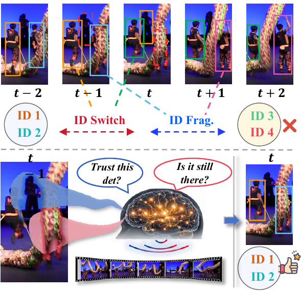
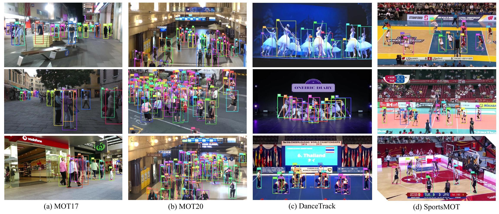
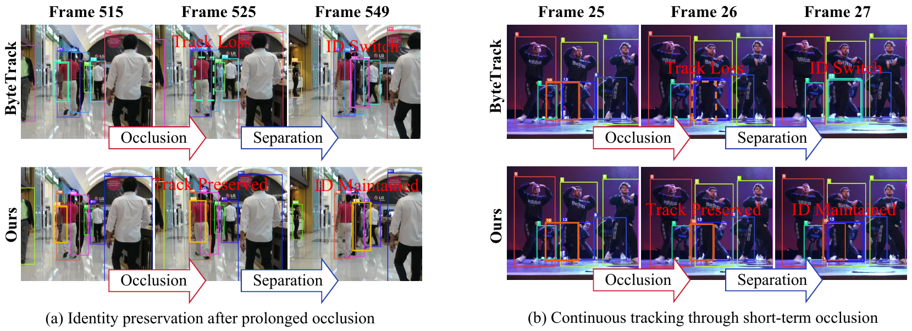

# MemoTrack

<div align="center">

**MemoTrack: Online Multi-Object Tracking by Existence Query**


[](LICENSE)


</div>

MemoTrack is an online multi-object tracker that turns the Probability
Hypothesis Density (PHD) posterior into a queryable cross-frame
existence-evidence field. Instead of using the PHD filter as a standalone RFS
tracker or replacing the Kalman filter, MemoTrack keeps the standard
tracking-by-detection pipeline and injects posterior evidence into association.
The tracker contains two modules: **Posterior Track Calibration (PTC)** for
track-side reliability refinement and **Track-Conditioned Evidence Recovery
(TCER)** for controlled low-score recovery.

<p align="center">
  
  
</p>
<p align="center">
  
</p>
<p align="center">
  
</p>

## Highlights

- MemoTrack uses the PHD posterior as auxiliary existence evidence rather than
  as an identity-producing tracker, making RFS-style temporal memory compatible
  with modern online MOT pipelines.
- PTC queries posterior support at predicted track locations to suppress
  unreliable primary associations in crowded scenes.
- TCER recovers genuine low-score observations only when they are supported by
  posterior existence evidence, short-term lost-track explainability, and local
  structural safety.
- The same posterior-evidence configuration is used across MOT17, MOT20,
  DanceTrack, and SportsMOT, with only dataset-specific detector thresholds and
  standard post-processing settings.

## Tracking Performance

Results on public test sets are summarized below. `MemoTrack*` follows the
stronger-detector setting used by prior SportsMOT trackers.

| Dataset | Setting | HOTA | IDF1 | MOTA | AssA | IDs |
| --- | --- | ---: | ---: | ---: | ---: | ---: |
| MOT17 | test | 66.3 | 82.0 | 80.5 | 67.6 | 1014 |
| MOT20 | test | 66.3 | 82.0 | 77.0 | 69.1 | 685 |
| DanceTrack | test | 60.2 | 61.1 | 93.2 | 45.0 | - |
| SportsMOT | test | 70.9 | 72.0 | 94.6 | 59.3 | - |
| SportsMOT | test, stronger detector | 72.0 | 73.1 | 96.4 | 59.9 | - |

## Installation

The code was tested on Ubuntu 22.04 with CUDA, PyTorch, YOLOX, FastReID, and
TrackEval.

```bash
git clone https://github.com/wangproc/MemoTrack.git
cd MemoTrack

conda env create -f environment.yml
conda activate boostTrack
```

Install external detector/ReID dependencies if they are not already available in
your environment:

```bash
cd external/YOLOX
pip install -r requirements.txt && python setup.py develop

cd ../deep-person-reid
pip install -r requirements.txt && python setup.py develop

cd ../fast_reid
pip install -r docs/requirements.txt
cd ../..
```

## Data Preparation

Download the datasets and place them under `data/`:

```text
data/
|-- MOT17/
|   |-- train/
|   `-- test/
|-- MOT20/
|   |-- train/
|   `-- test/
|-- dancetrack/
|   |-- train/
|   |-- val/
|   `-- test/
`-- sportsmot_publish/
    |-- splits_txt/
    `-- dataset/
        |-- train/
        |-- val/
        `-- test/
```

Convert MOT17, MOT20, and DanceTrack annotations to COCO-style metadata:

```bash
python data/tools/convert_mot17_to_coco.py
python data/tools/convert_mot20_to_coco.py
python data/tools/convert_dance_to_coco.py
```

For SportsMOT, generate annotation files and TrackEval seqmaps with:

```bash
python prepare_sportsmot.py --data_root data/sportsmot_publish
```

## Model Zoo and Weights

All detector and ReID weights should be placed in `external/weights/`. The table
lists the expected local filenames and the upstream sources used in our
experiments.

| Dataset | Expected files | Source |
| --- | --- | --- |
| MOT17/MOT20 | `bytetrack_ablation.pth.tar`, `bytetrack_x_mot17.pth.tar`, `bytetrack_x_mot20.tar`, `osnet_ain_ms_d_c.pth.tar`, `mot17_sbs_S50.pth`, `mot20_sbs_S50.pth` | BoostTrack / Deep-OC-SORT weights: [Google Drive](https://drive.google.com/drive/folders/15hZcR4bW_Z9hEaXXjeWhQl_jwRKllauG?usp=sharing) |
| DanceTrack | `bytetrack_dance_model.pth.tar`, `dance.pth.tar`, `dance_sbs_S50.pth` | TrackTrack-style DanceTrack weights: [link 1](https://drive.google.com/file/d/1O__fCM3gPbzHtav3XrlzHjjs96Dl45m8/view), [link 2](https://drive.google.com/file/d/12rBCIYLCXqT8bYmNrEwNdp6MmJ7whEg-/view) |
| SportsMOT | `SportsMOT_yolox_x.tar`, `SportsMOT_yolox_x_mix.tar`, `sports_sbs_S50.pth` | DiffMOT/SportsMOT weights: [release page](https://github.com/Kroery/DiffMOT/releases/tag/v1.0), [Sports-SBS-S50](https://github.com/Kroery/DiffMOT/releases/download/v1.0/sports_sbs_S50.pth) |

You may also pass absolute paths at runtime with `--detector_path` and
`--reid_path`, which is useful when weights are stored outside the repository.

## Running MemoTrack

### Validation

The helper script runs the common validation commands:

```bash
DATA_DIR=/path/to/data \
GT_DIR=/path/to/results/gt \
SPORTSMOT_DATA_DIR=/path/to/sportsmot_publish/dataset \
bash scripts/run_validation.sh
```

Individual runs are often easier for debugging:

```bash
# MOT17 / MOT20 half-validation
python main.py --dataset mot17 --exp_name MemoTrack_MOT17_val --post_mode post_gbi
python main.py --dataset mot20 --exp_name MemoTrack_MOT20_val --post_mode post_gbi

# DanceTrack / SportsMOT validation
python main.py --dataset dance --exp_name MemoTrack_Dance_val --post_mode post
python main.py --dataset sportsmot \
  --data_dir data/sportsmot_publish/dataset \
  --exp_name MemoTrack_Sports_val \
  --post_mode post
```

Evaluate MOT-style results with TrackEval:

```bash
python external/TrackEval/scripts/run_mot_challenge.py \
  --SPLIT_TO_EVAL val \
  --GT_FOLDER results/gt \
  --TRACKERS_FOLDER results/trackers \
  --BENCHMARK MOT17 \
  --TRACKERS_TO_EVAL MemoTrack_MOT17_val_post_gbi \
  --USE_PARALLEL False \
  --METRICS HOTA CLEAR Identity \
  --PLOT_CURVES False \
  --PRINT_ONLY_COMBINED True
```

### Test Submission

To generate all submission files:

```bash
DATA_DIR=/path/to/data \
SPORTSMOT_DATA_DIR=/path/to/sportsmot_publish/dataset \
bash scripts/run_test_submissions.sh
```

The main test commands are:

```bash
# MOT17 uses all three public detector splits on the test set.
python main.py --dataset mot17 --test_dataset --all_mot17_detectors \
  --exp_name MemoTrack_MOT17_test --make_submission

python main.py --dataset mot20 --test_dataset \
  --exp_name MemoTrack_MOT20_test --make_submission

python main.py --dataset dance --test_dataset \
  --detector_path external/weights/dance.pth.tar \
  --reid_path external/weights/dance_sbs_S50.pth \
  --exp_name MemoTrack_Dance_test --make_submission
```

SportsMOT has two detector settings:

```bash
# Standard detector
python main.py --dataset sportsmot --test_dataset \
  --data_dir data/sportsmot_publish/dataset \
  --detector_path external/weights/SportsMOT_yolox_x.tar \
  --reid_path external/weights/sports_sbs_S50.pth \
  --exp_name MemoTrack_Sports_test --make_submission

# Stronger detector setting
python main.py --dataset sportsmot --test_dataset \
  --data_dir data/sportsmot_publish/dataset \
  --detector_path external/weights/SportsMOT_yolox_x_mix.tar \
  --reid_path external/weights/sports_sbs_S50.pth \
  --exp_name MemoTrack_Sports_test_mix --make_submission
```

Each `--make_submission` command creates a flat zip file under `results/`.

## Visualization

Render qualitative tracking boxes:

```bash
python tools/visualize_tracking_result.py \
  --dataset mot17 \
  --result_dir results/trackers/MOT17-val/MemoTrack_MOT17_val_post_gbi/data \
  --output_dir results/img_result/qualitative/mot17
```

Render PHD intensity overlays:

```bash
python tools/visualize_phd_intensity.py \
  --dataset mot17 \
  --exp_name MemoTrack_heatmap \
  --output_dir results/img_result/phd_intensity/mot17
```

## Repository Layout

```text
MemoTrack/
|-- main.py                    # unified entry for validation and test submission
|-- memotracker/               # MemoTrack core, PHD posterior, PTC, and TCER
|-- external/                  # detector, ReID, and TrackEval dependencies
|-- data/tools/                # dataset conversion helpers
|-- tools/                     # qualitative visualization and PHD heatmap tools
|-- scripts/                   # reproducible validation and submission scripts
|-- results/                   # generated tracking outputs and submissions
`-- environment.yml            # conda environment
```

Datasets, model weights, caches, and generated results are intentionally ignored
by git.

## Acknowledgements

MemoTrack builds on public components from the MOT community, including YOLOX,
FastReID, TrackEval, ByteTrack-style detectors, BoT-SORT/Deep-OC-SORT ReID
models, BoostTrack utilities, TrackTrack-style DanceTrack weights, and DiffMOT
SportsMOT resources. We sincerely thank the authors for making their code and
models available.

## Citation

If MemoTrack is useful for your research, please cite:

```bibtex
@article{memotrack,
  title={MemoTrack: Online Multi-Object Tracking by Existence Query},
  author={},
  journal={},
  year={}
}
```
